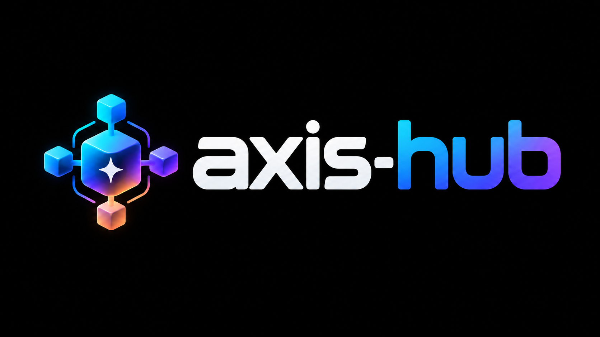
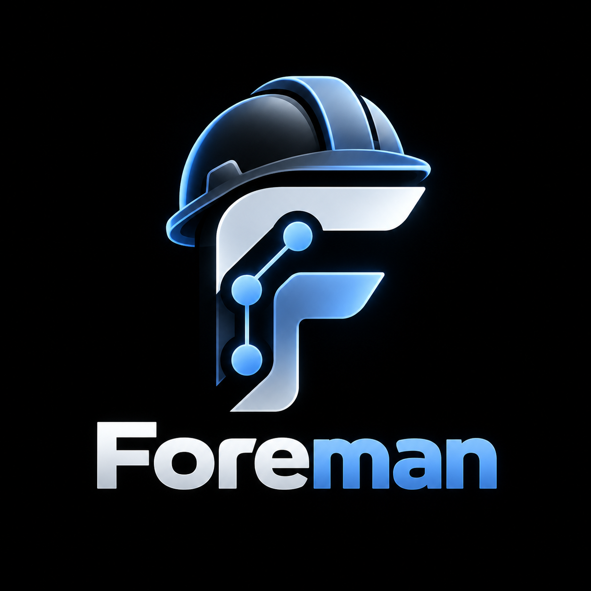

<p align="center">
  
</p>

# axis-hub

Claude Code plugin marketplace by Black-Axis.

## Requirements

- [Claude Code](https://code.claude.com/docs) v2.1.269 or later (the one-step install below needs v2.1.275 or later).
- [Node.js](https://nodejs.org/) on `PATH` (optional) - foreman's hooks and state script use it: the session-start summary, prompt-free `workbench/` changes, and exact tracking updates. Without it the hooks are skipped and tracking is updated by hand, with no errors.

## Install

### 1. Add the marketplace

Inside Claude Code (`/plugin marketplace add`) or from your shell (`claude plugin marketplace add`) - both take the same sources:

| Source | Command |
|--------|---------|
| GitHub shorthand | `/plugin marketplace add Black-Axis/axis-hub` |
| URL (HTTPS) | `/plugin marketplace add https://github.com/Black-Axis/axis-hub.git` |
| URL (SSH) | `/plugin marketplace add git@github.com:Black-Axis/axis-hub.git` |
| Pinned version (tag or branch) | `/plugin marketplace add https://github.com/Black-Axis/axis-hub.git#vX.Y.Z` (a [release tag](https://github.com/Black-Axis/axis-hub/releases)) |
| Local clone | `/plugin marketplace add ./path/to/axis-hub` (start relative paths with `./` or `../`) |

Always include `https://` in URLs; without it Claude Code reads the text as `owner/repo` shorthand.

### 2. Install a plugin

```
/plugin install foreman@axis-hub
```

In a session this opens the plugin's details so you can review it and choose a scope: **you** (all your projects), **this repository** (everyone working in it), or **you, in this repository only**.

From your shell (default scope: you; add `--scope project` or `--scope local`):

```
claude plugin marketplace add https://github.com/Black-Axis/axis-hub.git
claude plugin install foreman@axis-hub
```

### Add and install in one step

Claude Code v2.1.275 or later:

```
/plugin install foreman --marketplace https://github.com/Black-Axis/axis-hub.git
```

### Set it up for a whole team

Commit this to your project's `.claude/settings.json` so everyone who works in the repository gets the marketplace and has foreman turned on:

```json
{
  "extraKnownMarketplaces": {
    "axis-hub": {
      "source": { "source": "github", "repo": "Black-Axis/axis-hub" }
    }
  },
  "enabledPlugins": {
    "foreman@axis-hub": true
  }
}
```

Each teammate still downloads the plugin once with `claude plugin install foreman@axis-hub --scope project`.

### Updates

Auto-update is off by default for third-party marketplaces like this one. Turn it on in `/plugin` → **Marketplaces** → `axis-hub` → **Enable auto-update**, or update manually:

```
claude plugin marketplace update axis-hub
claude plugin update foreman@axis-hub
```

Remove with `claude plugin uninstall foreman@axis-hub` or, to remove the marketplace and all its plugins, `claude plugin marketplace remove axis-hub`.

## Plugins

| Plugin | Version | Description |
|--------|---------|-------------|
|  [foreman](plugins/foreman/README.md) | 1.5.0 | Plan, contract, track, delegate, and document feature work in a `workbench/` folder |

- What changed: [CHANGELOG.md](CHANGELOG.md) (marketplace) and each plugin's `CHANGELOG.md`.
- See it in action: [examples/foreman](examples/foreman/README.md) - a sample `workbench/`.

## Contributing

Plugins live in `plugins/<name>/`. Before pushing, run `claude plugin validate .`, `claude plugin validate plugins/<name>`, and `node --test`; GitHub Actions runs the same checks on every pull request.

See [CONTRIBUTING.md](CONTRIBUTING.md) for the full guide. All participants follow the [Code of Conduct](CODE_OF_CONDUCT.md).

## Security

Report vulnerabilities privately - see [SECURITY.md](SECURITY.md).

## Authors

See [AUTHORS.md](AUTHORS.md).

## License

[MIT](LICENSE.md)
